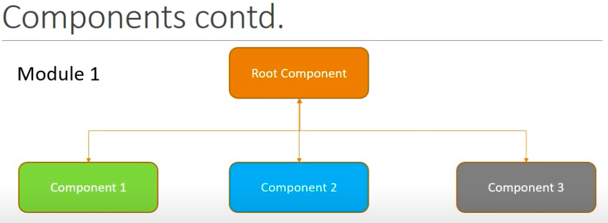
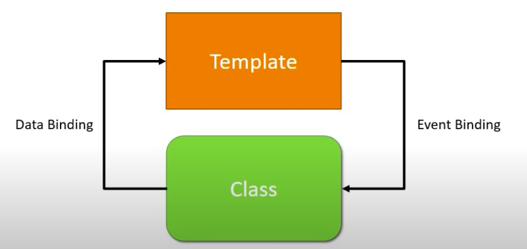
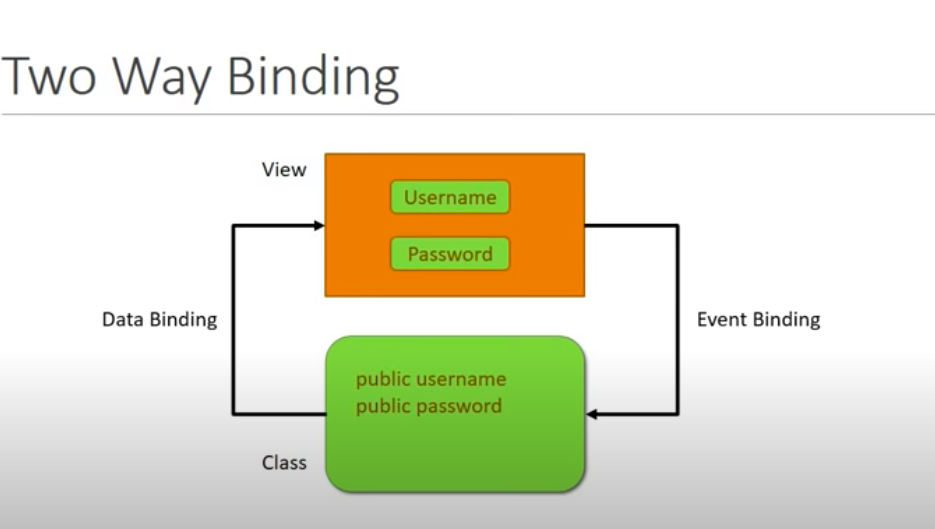
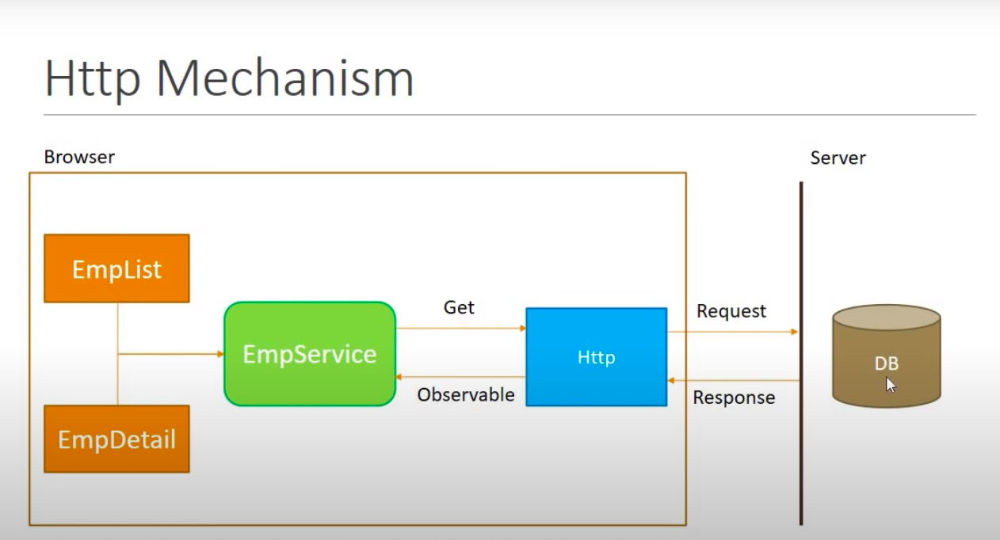

# Angular

## What and Why?

- Angular is a framework for building client side applications
- Great for SPAs
- Modular approach
- Re-usable code since it uses components
- Development quicker and easier
- Unit Testable
- Developed by Google and uses some libraries of Microsoft

## Hello World

ng new hello-world
cd hello-world
ng serve

Each component will have an HTML Template for view in browser and Class that control the logic of the view

## Component

Component = Template + Class + Metadata

- Template
  - View
  - HTML
- Class
  - Code
  - TypeScript
  - Data & Methods
- Metadata
  - Information: Contains information whether the given class is component class or normal class
  - Decorator: Metadata is defined using Decorator. A decorator is a function that provides info about the class attached to it.

### Creating a component

ng generate component component_name \
OR
ng g c component_name

$0 refers to current event
$0.getAttribute('value') returns the HTML set value
$0.value returns the DOM value (current value)

Parent component sends data to Child component using Selectors defined in Child Component
Child component sends data to Parent component using Events defined in Child Component

To create a service:
ng g s

### Creating a component with inline template and inline style

ng generate component component_name -it -is \ 
OR
ng g c component_name -it -is

it: Inline template \ 
is: Inline style